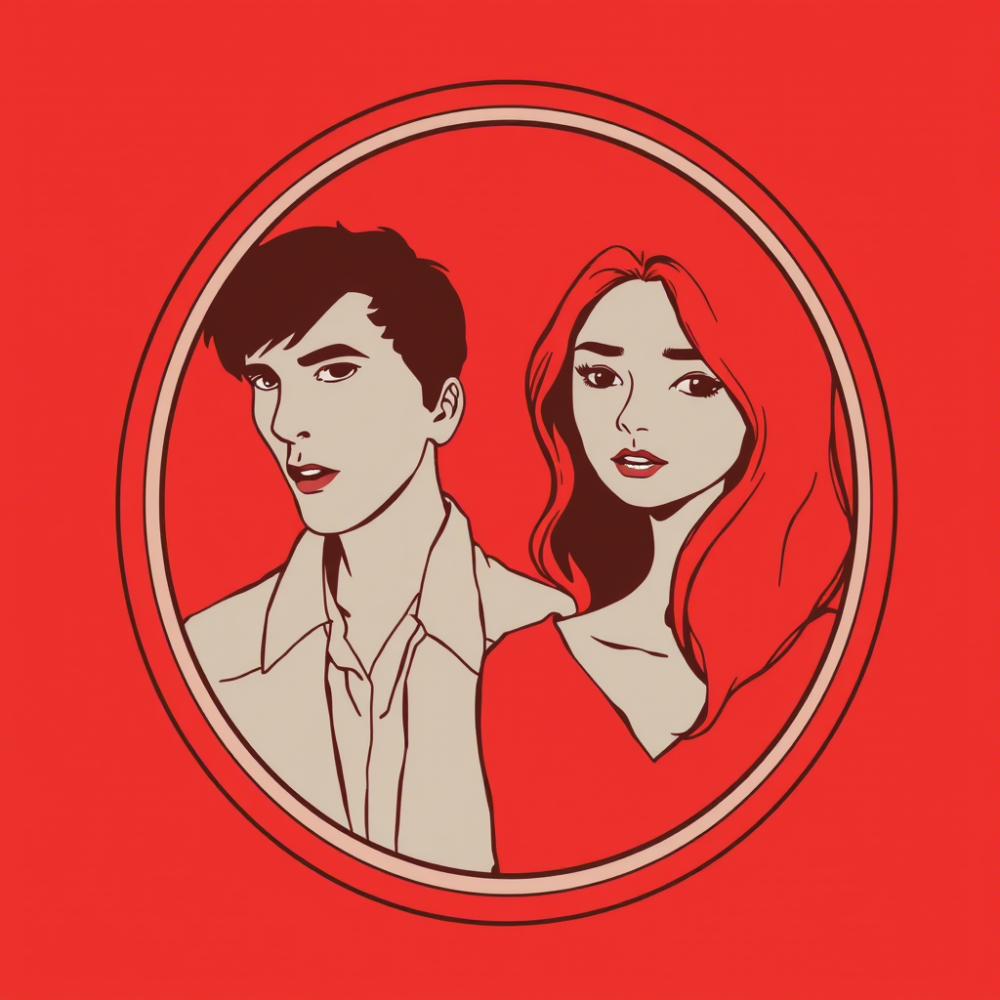

# Rozdział 1: Lustrzane Odbicie

Marta zobaczyła Adama podczas dyskusji o prawach zwierząt. Nie odezwał się ani słowem, ale jego przytakiwanie i uśmiech
sugerowały, że podziela jej zaangażowanie. Wieczorem, rozmawiając, Adam słuchał z uwagą jej idealistycznych wizji
świata, nie przerywając. "Co myślisz o propozycji całkowitego zakazu hodowli przemysłowej?" zapytała, szukając
potwierdzenia swoich przekonań. Adam uśmiechnął się łagodnie, wypił łyk wina i zaczął opowiadać o swoich studiach,
zręcznie omijając pytanie. Dla Marty jego unik był niemal niezauważalny – wypełniła jego milczenie własnymi
założeniami. "Zawsze byłeś taki wrażliwy na cierpienie?" spytała, dotykając jego dłoni. Spojrzał na nią z czułością,
nieznacznie się wzdrygając – drobny gest dyskomfortu, którego nie dostrzegła. Jego pragmatyczna natura podpowiadała, że
korekta jej założeń wprowadziłaby niepotrzebne napięcie. "Lepiej nie burzyć tej chwili," pomyślał, nie zdając sobie
sprawy, jak wysoką cenę przyjdzie im za to zapłacić.