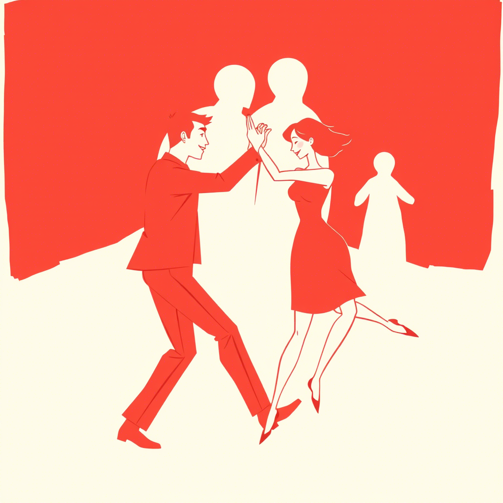

# Rozdział 2: Złudzenie Harmonii

Trzy miesiące później ich związek kwitł w oparciu o niezachwianą wiarę Marty, że Adam podziela jej wartości. "
Przygotowałam dla nas kolację wegetariańską, jak lubisz," powiedziała pewnego wieczoru. Adam skrzywił się nieznacznie,
zanim uśmiech wrócił na jego twarz. Nie sprostował jej założenia, choć mięso jadał regularnie w pracy. 

"Dlaczego nigdy
nie stajesz z nami w pierwszym szeregu protestów?" zapytała kilka dni później wprost. Adam spojrzał w dal, wskazał na
zachodzące słońce i powiedział: "Piękny widok, prawda?" – a ona, zauroczona chwilą, zapomniała o pytaniu. 

Wewnątrz Adama kiełkowała irytacja. Podczas wspólnej kolacji ze znajomymi, gdy Marta z pasją opowiadała o kolejnej akcji, zacisnął
palce na kieliszku wina. 

"Czy naprawdę wierzysz, że te protesty coś zmienią?" zapytał później z ledwie wyczuwalną nutą
sceptycyzmu – pierwszym sygnałem pęknięcia w fasadzie. "A ty nie?" odpowiedziała pytaniem, jej oczy pełne nadziei.

Zamiast odpowiedzieć, pocałował ją delikatnie, choć w jego umyśle formowała się już odpowiedź, której nie miał odwagi
wypowiedzieć.