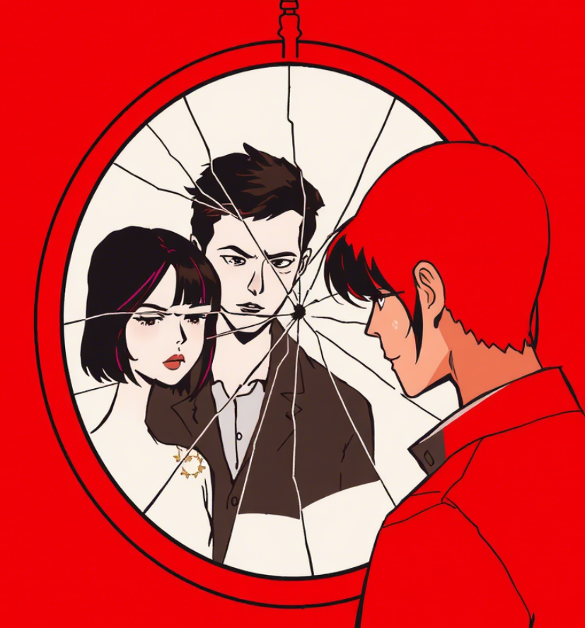

# Rozdział 3: Pierwsza Rysa

Tydzień po nieudanym proteście Marty przeciwko nowemu projektowi korporacyjnemu, spotkanie firmowe Adama stało się
punktem zwrotnym. Marta przyszła niespodziewanie i zastała go śmiejącego się z kolegami, jedzącego stek i – co
najgorsze – omawiającego zalety tego samego projektu, który ona zwalczała. "Jak mogłeś?" – szepnęła, gdy wyszli na
zewnątrz. "Nigdy nie powiedziałem, że jestem wegetarianinem. Nigdy nie mówiłem, że potępiam ten projekt," odpowiedział
Adam, jego głos ostrzejszy niż zamierzał. "Ale przecież... gdy pytałam cię o te kwestie... myślałam, że... dlaczego
nigdy nie powiedziałeś mi prawdy?" Marta czuła, jak fundamenty ich związku pękają. Adam wpatrywał się w chodnik, jego
twarz napięta. "Zbiera się na deszcz," zauważył, zmieniając temat. "Czy ty mnie w ogóle słuchasz?" zapytała z
narastającą frustracją. Adam wydawał się walczyć ze sobą – część niego chciała wyjaśnić, że początkowo zależało mu po
prostu na harmonii, później bał się jej rozczarowania, aż wreszcie zaczął czuć się osaczony jej wartościami. Zamiast
tego powiedział tylko: "Porozmawiajmy o tym kiedy indziej," jego głos drżący od tłumionych emocji.