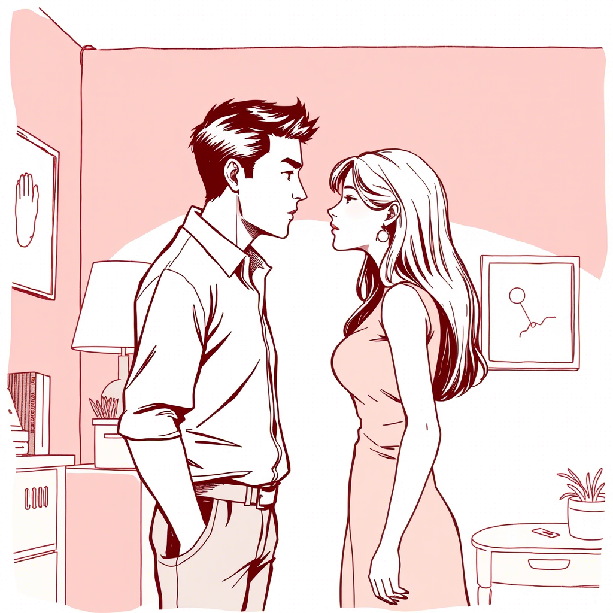

# Rozdział 4: Konfrontacja

"Zbudowałam nas na kłamstwie, którego sama byłam autorką," powiedziała Marta, siedząc na przeciwległym końcu kanapy.
Adam już nie hamował frustracji, która narastała w nim przez miesiące. 

"Wasze protesty szkodzą lokalnym przedsiębiorcom.
A wegetarianizm? Szanuję wybór, ale nie uważam go za moralny imperatyw.

"Jego ton był ostrzejszy niż kiedykolwiek, ale wciąż daleki od skrajności. "Czy zawsze tak myślałeś, czy dopiero teraz, gdy czujesz się osaczony?" zapytała cicho. 

Adam wstał, podszedł do okna, jego ramiona napięte. "Zawsze byłem pragmatykiem. 

Na początku... nie przywiązywałem wagi do
tych kwestii. Potem..." urwał, niezdolny do przyznania, jak bardzo jej założenia go uwierały. 

Marta potrząsnęła głową. "Dlaczego więc pozwoliłeś mi wierzyć, że podzielasz moje przekonania?" Adam nalał sobie whisky, wciąż nie patrząc jej w oczy. 
"Bo na początku nie miało to znaczenia. 

A później... bałem się, że stracę cię, gdy poznasz prawdę." 
Zapadła ciężka cisza. 
"Czy nadal mnie kochasz?" zapytała w końcu, jej głos ledwie słyszalny. 

Upił łyk alkoholu, a jego milczenie było jak ściana między nimi – nie z braku miłości, ale z nadmiaru nagromadzonych nieporozumień i żalu.