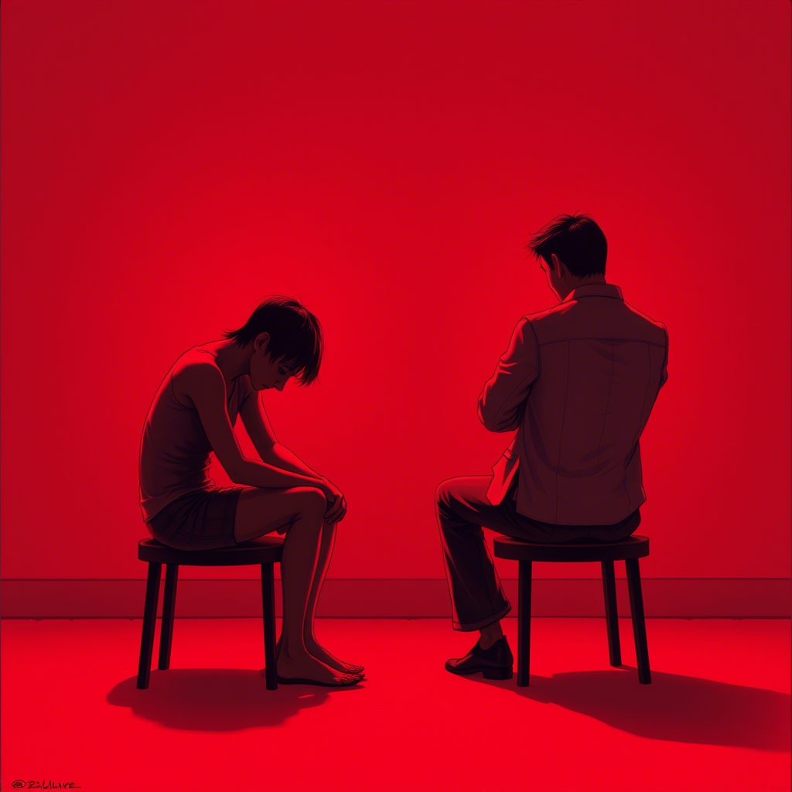

# Rozdział 5: Retrospekcja

W ciszy swojego mieszkania Marta analizowała minione miesiące, dostrzegając sygnały, które ignorowała. Drobne grymasy
Adama przy jej idealistycznych deklaracjach. Jego nieobecność na protestach. 
Zmiana tematu, gdy rozmowa stawała się zbyt polityczna.

"Dlaczego tak desperacko potrzebowałam, żeby był moim odbiciem?" zapytała pustą przestrzeń. 

Adam tymczasem przeglądał dokumentację projektu, który dwa dni wcześniej, po konfrontacji z Martą, 
celowo przekierował do dostawcy, którego ona krytykowała. 

Zatrzymał się w połowie zdania, zdumiony własnym zachowaniem. 
"Dlaczego to zrobiłem? Przecież wcześniej rozważałem jej argumenty..." 

Przypomniał sobie, jak stopniowo, z każdą niewypowiedzianą niezgodą, rosła w nim potrzeba odreagowania. 
"Co właściwie czujesz do wegetarianizmu?" – zapytał go kiedyś kolega z pracy. 
"Szczerze?

Obojętność," odpowiedział wtedy, by za chwilę dodać z nieoczekiwaną goryczą: 
"Chociaż słuchając niektórych, to fanatyzm." 

Jego własna odpowiedź zaskoczyła go – kiedy obojętność przerodziła się w antagonizm?

Czy dlatego, że jej wartości stały się klatką, czy może sam dla siebie stworzył więzienie z niewypowiedzianych słów?