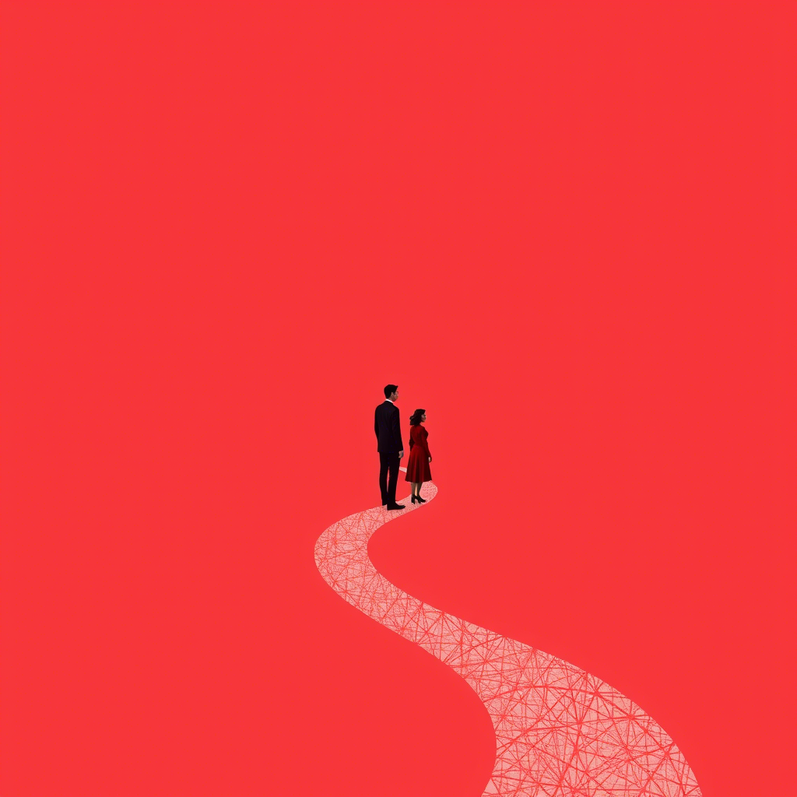

# Rozdział 6: Nowy Początek

Po dwóch tygodniach spotkali się w neutralnej przestrzeni – kawiarni. "Zrozumiałam coś ważnego," powiedziała Marta. "
Potrzebowałam, żebyś był odbiciem moich przekonań. Gdy milczałeś, wypełniłam tę ciszę własną narracją." Adam skinął
głową. "A ja, zamiast być szczerym, pozwoliłem na tę iluzję. Z czasem czułem się coraz bardziej osaczony tożsamością,
której nie wybierałem." Zapadła krótka cisza. "Czy myślisz, że gdybym od początku nie robiła tylu założeń, wszystko
potoczyłoby się inaczej?" spytała z wahaniem. Adam spojrzał przez okno, jego oczy podążały za parą trzymającą się za
ręce na ulicy. Odkryli bolesną prawdę – wartości, które wcześniej były dla niego neutralne, stały się punktami oporu,
gdy poczuł, że są mu narzucane. "Czy wciąż jest dla nas szansa?" – zapytała cicho. "Może istnieje przestrzeń między
całkowitą zgodą a wrogością?" dodała, gdy odpowiedź nie nadchodziła. Adam ściskał w dłoniach kubek z kawą, jego twarz
łagodniejsza niż przez ostatnie tygodnie. "Nie wiem," przyznał wreszcie. "Ale chciałbym się dowiedzieć, kim jesteśmy
poza tymi rolami, w które się zaszufladkowaliśmy. Czy można kochać kogoś, kto reprezentuje odmienne wartości, nie
próbując go zmienić?"