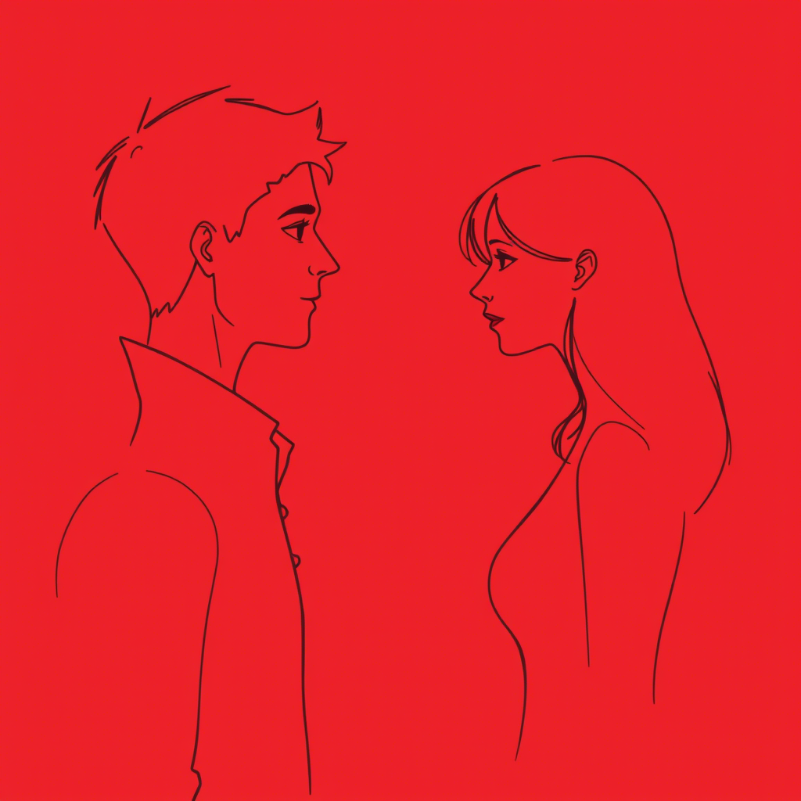

# Epilog

Rok później siedzieli na tarasie, patrząc na zachód słońca. "Wiesz," powiedział Adam, "nie zdawałem sobie sprawy, jak
subtelnie to wszystko się rozwijało. Moje początkowo neutralne milczenie, twoje założenia, moja narastająca frustracja,
aż w końcu zacząłem definiować się przez negację twoich wartości." Marta skinęła głową. "A ja nie widziałam, jak moja
potrzeba ideologicznego dopasowania nakładała na ciebie maskę, którą w końcu zacząłeś nienawidzić." Zrozumieli dynamikę,
która niemal ich zniszczyła – jak niewypowiedziane różnice, zamiast być przedmiotem dialogu, stają się fundamentem coraz
głębszego podziału. "Myślisz, że możliwe jest, aby dwoje ludzi o tak odmiennych wartościach mogło naprawdę być razem?"
zapytała Marta, wpatrując się w horyzont, gdzie słońce zlewało się z morzem. "Czy możemy współistnieć bez udawania, bez
kompromisów, które powoli zamieniają się w ciche resentymenty?" Adam spojrzał na nią długo. Cisza między nimi
rozciągnęła się jak ocean światła przed nimi. Tym razem jednak ta cisza była inna – nie była przestrzenią na projekcje i
założenia, ale na autentyczne pytanie, na które odpowiedź mogła przyjść tylko z czasem i doświadczeniem ich wspólnej
podróży.