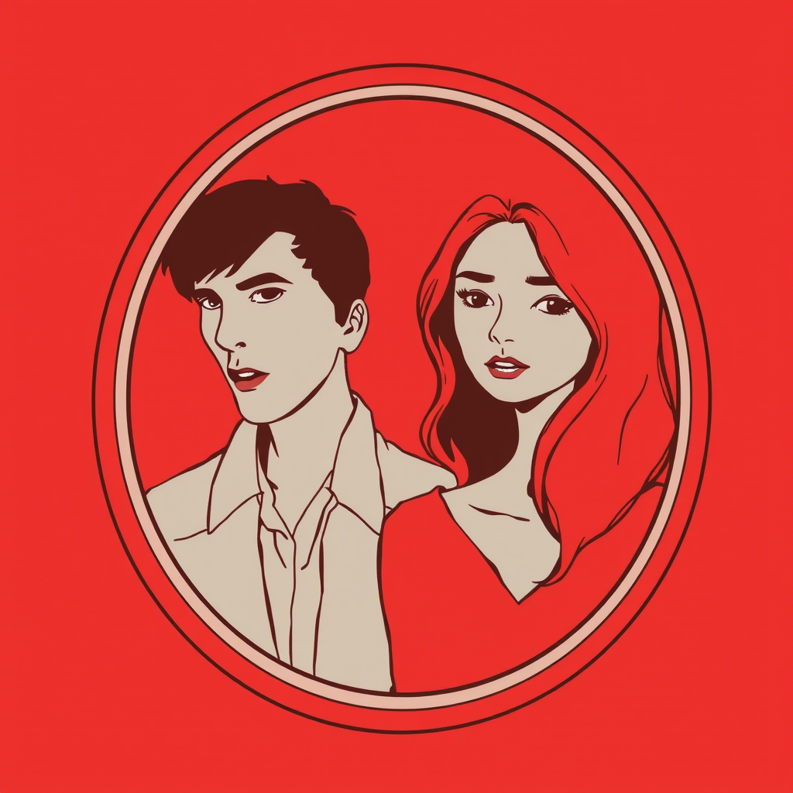
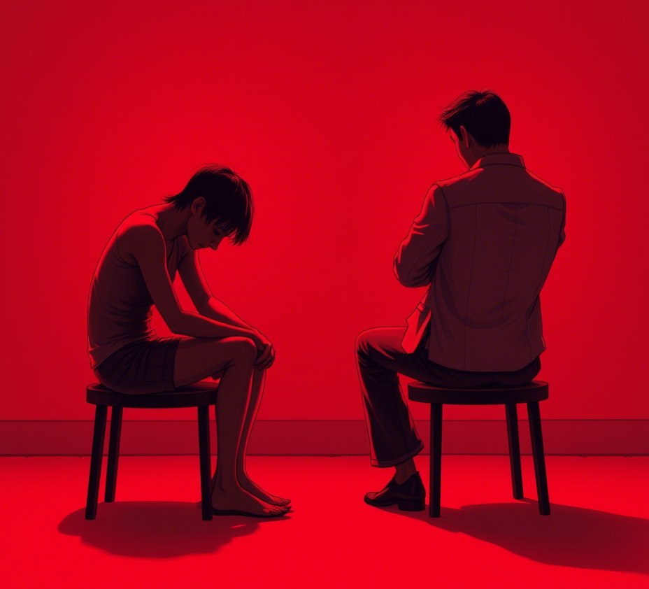

 

# Taciturnitas - Milcząca prawda

**Tom Sapletta**

*Frankfurt 2025*

---

## Spis treści

1. Rozdział 1: Lustrzane Odbicie
2. Rozdział 2: Złudzenie Harmonii
3. Rozdział 3: Pierwsza Rysa
4. Rozdział 4: Konfrontacja
5. Rozdział 5: Retrospekcja
6. Rozdział 6: Nowy Początek
7. Epilog
8. Posłowie

# Rozdział 1: Lustrzane Odbicie

Marta zobaczyła Adama podczas dyskusji o prawach zwierząt. Nie odezwał się ani słowem, ale jego przytakiwanie i uśmiech
sugerowały, że podziela jej zaangażowanie. Wieczorem, rozmawiając, Adam słuchał z uwagą jej idealistycznych wizji
świata, nie przerywając. "Co myślisz o propozycji całkowitego zakazu hodowli przemysłowej?" zapytała, szukając
potwierdzenia swoich przekonań. Adam uśmiechnął się łagodnie, wypił łyk wina i zaczął opowiadać o swoich studiach,
zręcznie omijając pytanie. Dla Marty jego unik był niemal niezauważalny – wypełniła jego milczenie własnymi
założeniami. "Zawsze byłeś taki wrażliwy na cierpienie?" spytała, dotykając jego dłoni. Spojrzał na nią z czułością,
nieznacznie się wzdrygając – drobny gest dyskomfortu, którego nie dostrzegła. Jego pragmatyczna natura podpowiadała, że
korekta jej założeń wprowadziłaby niepotrzebne napięcie. "Lepiej nie burzyć tej chwili," pomyślał, nie zdając sobie
sprawy, jak wysoką cenę przyjdzie im za to zapłacić.

# Rozdział 2: Złudzenie Harmonii

Trzy miesiące później ich związek kwitł w oparciu o niezachwianą wiarę Marty, że Adam podziela jej wartości. "
Przygotowałam dla nas kolację wegetariańską, jak lubisz," powiedziała pewnego wieczoru. Adam skrzywił się nieznacznie,
zanim uśmiech wrócił na jego twarz. Nie sprostował jej założenia, choć mięso jadał regularnie w pracy. "Dlaczego nigdy
nie stajesz z nami w pierwszym szeregu protestów?" zapytała kilka dni później wprost. Adam spojrzał w dal, wskazał na
zachodzące słońce i powiedział: "Piękny widok, prawda?" – a ona, zauroczona chwilą, zapomniała o pytaniu. Wewnątrz Adama
kiełkowała irytacja. Podczas wspólnej kolacji ze znajomymi, gdy Marta z pasją opowiadała o kolejnej akcji, zacisnął
palce na kieliszku wina. "Czy naprawdę wierzysz, że te protesty coś zmienią?" zapytał później z ledwie wyczuwalną nutą
sceptycyzmu – pierwszym sygnałem pęknięcia w fasadzie. "A ty nie?" odpowiedziała pytaniem, jej oczy pełne nadziei.
Zamiast odpowiedzieć, pocałował ją delikatnie, choć w jego umyśle formowała się już odpowiedź, której nie miał odwagi
wypowiedzieć.

# Rozdział 3: Pierwsza Rysa

Tydzień po nieudanym proteście Marty przeciwko nowemu projektowi korporacyjnemu, spotkanie firmowe Adama stało się
punktem zwrotnym. Marta przyszła niespodziewanie i zastała go śmiejącego się z kolegami, jedzącego stek i – co
najgorsze – omawiającego zalety tego samego projektu, który ona zwalczała. "Jak mogłeś?" – szepnęła, gdy wyszli na
zewnątrz. "Nigdy nie powiedziałem, że jestem wegetarianinem. Nigdy nie mówiłem, że potępiam ten projekt," odpowiedział
Adam, jego głos ostrzejszy niż zamierzał. "Ale przecież... gdy pytałam cię o te kwestie... myślałam, że... dlaczego
nigdy nie powiedziałeś mi prawdy?" Marta czuła, jak fundamenty ich związku pękają. Adam wpatrywał się w chodnik, jego
twarz napięta. "Zbiera się na deszcz," zauważył, zmieniając temat. "Czy ty mnie w ogóle słuchasz?" zapytała z
narastającą frustracją. Adam wydawał się walczyć ze sobą – część niego chciała wyjaśnić, że początkowo zależało mu po
prostu na harmonii, później bał się jej rozczarowania, aż wreszcie zaczął czuć się osaczony jej wartościami. Zamiast
tego powiedział tylko: "Porozmawiajmy o tym kiedy indziej," jego głos drżący od tłumionych emocji.

# Rozdział 4: Konfrontacja

"Zbudowałam nas na kłamstwie, którego sama byłam autorką," powiedziała Marta, siedząc na przeciwległym końcu kanapy.
Adam już nie hamował frustracji, która narastała w nim przez miesiące. "Wasze protesty szkodzą lokalnym przedsiębiorcom.
A wegetarianizm? Szanuję wybór, ale nie uważam go za moralny imperatyw." Jego ton był ostrzejszy niż kiedykolwiek, ale
wciąż daleki od skrajności. "Czy zawsze tak myślałeś, czy dopiero teraz, gdy czujesz się osaczony?" zapytała cicho. Adam
wstał, podszedł do okna, jego ramiona napięte. "Zawsze byłem pragmatykiem. Na początku... nie przywiązywałem wagi do
tych kwestii. Potem..." urwał, niezdolny do przyznania, jak bardzo jej założenia go uwierały. Marta potrząsnęła głową. "
Dlaczego więc pozwoliłeś mi wierzyć, że podzielasz moje przekonania?" Adam nalał sobie whisky, wciąż nie patrząc jej w
oczy. "Bo na początku nie miało to znaczenia. A później... bałem się, że stracę cię, gdy poznasz prawdę." Zapadła ciężka
cisza. "Czy nadal mnie kochasz?" zapytała w końcu, jej głos ledwie słyszalny. Upił łyk alkoholu, a jego milczenie było
jak ściana między nimi – nie z braku miłości, ale z nadmiaru nagromadzonych nieporozumień i żalu.

# Rozdział 5: Retrospekcja

W ciszy swojego mieszkania Marta analizowała minione miesiące, dostrzegając sygnały, które ignorowała. Drobne grymasy
Adama przy jej idealistycznych deklaracjach. Jego nieobecność na protestach. Zmiana tematu, gdy rozmowa stawała się zbyt
polityczna. "Dlaczego tak desperacko potrzebowałam, żeby był moim odbiciem?" zapytała pustą przestrzeń. Adam tymczasem
przeglądał dokumentację projektu, który dwa dni wcześniej, po konfrontacji z Martą, celowo przekierował do dostawcy,
którego ona krytykowała. Zatrzymał się w połowie zdania, zdumiony własnym zachowaniem. "Dlaczego to zrobiłem? Przecież
wcześniej rozważałem jej argumenty..." Przypomniał sobie, jak stopniowo, z każdą niewypowiedzianą niezgodą, rosła w nim
potrzeba odreagowania. "Co właściwie czujesz do wegetarianizmu?" – zapytał go kiedyś kolega z pracy. "Szczerze?
Obojętność," odpowiedział wtedy, by za chwilę dodać z nieoczekiwaną goryczą: "Chociaż słuchając niektórych, to
fanatyzm." Jego własna odpowiedź zaskoczyła go – kiedy obojętność przerodziła się w antagonizm? Czy dlatego, że jej
wartości stały się klatką, czy może sam dla siebie stworzył więzienie z niewypowiedzianych słów?

# Rozdział 6: Nowy Początek

Po dwóch tygodniach spotkali się w neutralnej przestrzeni – kawiarni. "Zrozumiałam coś ważnego," powiedziała Marta. "
Potrzebowałam, żebyś był odbiciem moich przekonań. Gdy milczałeś, wypełniłam tę ciszę własną narracją." Adam skinął
głową. "A ja, zamiast być szczerym, pozwoliłem na tę iluzję. Z czasem czułem się coraz bardziej osaczony tożsamością,
której nie wybierałem." Zapadła krótka cisza. "Czy myślisz, że gdybym od początku nie robiła tylu założeń, wszystko
potoczyłoby się inaczej?" spytała z wahaniem. Adam spojrzał przez okno, jego oczy podążały za parą trzymającą się za
ręce na ulicy. Odkryli bolesną prawdę – wartości, które wcześniej były dla niego neutralne, stały się punktami oporu,
gdy poczuł, że są mu narzucane. "Czy wciąż jest dla nas szansa?" – zapytała cicho. "Może istnieje przestrzeń między
całkowitą zgodą a wrogością?" dodała, gdy odpowiedź nie nadchodziła. Adam ściskał w dłoniach kubek z kawą, jego twarz
łagodniejsza niż przez ostatnie tygodnie. "Nie wiem," przyznał wreszcie. "Ale chciałbym się dowiedzieć, kim jesteśmy
poza tymi rolami, w które się zaszufladkowaliśmy. Czy można kochać kogoś, kto reprezentuje odmienne wartości, nie
próbując go zmienić?"

# Epilog

Rok później siedzieli na tarasie, patrząc na zachód słońca. "Wiesz," powiedział Adam, "nie zdawałem sobie sprawy, jak subtelnie to wszystko się rozwijało. Moje początkowo neutralne milczenie, twoje założenia, moja narastająca frustracja, aż w końcu zacząłem definiować się przez negację twoich wartości." Marta skinęła głową. "A ja nie widziałam, jak moja potrzeba ideologicznego dopasowania nakładała na ciebie maskę, którą w końcu zacząłeś nienawidzić." Zrozumieli dynamikę, która niemal ich zniszczyła – jak niewypowiedziane różnice, zamiast być przedmiotem dialogu, stają się fundamentem coraz głębszego podziału. "Myślisz, że możliwe jest, aby dwoje ludzi o tak odmiennych wartościach mogło naprawdę być razem?" zapytała Marta, wpatrując się w horyzont, gdzie słońce zlewało się z morzem. "Czy możemy współistnieć bez udawania, bez kompromisów, które powoli zamieniają się w ciche resentymenty?" Adam spojrzał na nią długo. Cisza między nimi rozciągnęła się jak ocean światła przed nimi. Tym razem jednak ta cisza była inna – nie była przestrzenią na projekcje i założenia, ale na autentyczne pytanie, na które odpowiedź mogła przyjść tylko z czasem i doświadczeniem ich wspólnej podróży.

# Posłowie do opowiadania "Taciturnitas"

## O mechanizmach psychologicznych w opowiadaniu

"Taciturnitas" to krótkie studium psychologiczne ukazujące złożoną dynamikę relacji międzyludzkich, szczególnie w kontekście niewypowiedzianych różnic wartości i przekonań. Opowiadanie eksploruje kilka kluczowych mechanizmów psychologicznych, które często występują w bliskich relacjach:

### 1. Projekcja i idealizacja
Marta projektuje własne wartości i przekonania na Adama, tworząc wyidealizowany obraz partnera, który jest bardziej odbiciem jej samej niż rzeczywistej osoby. Ten mechanizm jest powszechny w początkowych etapach związku, gdy nasza potrzeba bliskości i zgodności przeważa nad percepcją rzeczywistych różnic.

### 2. Milczenie jako wieloznaczny komunikat
Opowiadanie pokazuje, jak milczenie może być interpretowane na wiele sposobów. Dla Marty milczenie Adama jest potwierdzeniem, dla niego samego – początkowo wygodnym unikiem, później więzieniem. W rzeczywistych relacjach milczenie rzadko jest neutralne; jest przestrzenią, którą wypełniamy własnymi założeniami i oczekiwaniami.

### 3. Mechanizm antagonizacji
Kluczowym elementem opowiadania jest proces, w którym Adam przechodzi od obojętności wobec wartości Marty do aktywnej wrogości wobec nich. Ten paradoksalny mechanizm psychologiczny występuje często w relacjach, gdzie jedna osoba czuje, że druga narzuca jej określoną tożsamość lub zestaw wartości. Antagonizm staje się formą obrony własnej autonomii, nawet jeśli prowadzi do irracjonalnego odrzucania wartości, które wcześniej nie budziły sprzeciwu.

### 4. Polaryzacja postaw
Opowiadanie ilustruje, jak łatwo w sytuacji konfliktu popadamy w myślenie binarne: jeśli nie jesteś ze mną, to jesteś przeciwko mnie. Ta polaryzacja jest szczególnie widoczna w relacjach, gdzie jedna strona postrzega swoje wartości jako fundamentalną część tożsamości. Każdy sprzeciw lub odmienność staje się wówczas nie różnicą zdań, lecz osobistym atakiem.

### 5. Reintegracja poprzez akceptację różnic
Droga do naprawy relacji wiedzie przez bolesne uświadomienie sobie własnych mechanizmów psychologicznych i akceptację odmienności drugiej osoby. Adam i Marta muszą odkryć, że różnica nie musi oznaczać antagonizmu, a tożsamość nie musi być budowana w opozycji do drugiej osoby.

## Znaczenie tytułu

Łacińskie słowo "taciturnitas" (małomówność, powściągliwość) doskonale oddaje centralny temat opowiadania – milczenie, które może być zarówno ochroną, jak i pułapką. Wskazuje na powściągliwość Adama, która początkowo wydaje się niewinną cechą charakteru, by później okazać się fundamentem poważnych nieporozumień. W kulturze rzymskiej "taciturnitas" była cenioną cnotą, co dodatkowo podkreśla ironię sytuacji – to, co tradycyjnie uważane za zaletę, staje się źródłem konfliktu.

## Uniwersalność tematyki

Historia Marty i Adama, choć osadzona w kontekście relacji romantycznej, odzwierciedla szersze zjawiska społeczne i polityczne widoczne we współczesnym świecie. W polaryzującym się społeczeństwie często obserwujemy podobną dynamikę – brak komunikacji prowadzi do wzmacniania stereotypów i uprzedzeń, a różnice wartości przekształcają się w aktywną wrogość. 

Szczególnie istotny jest mechanizm, w którym obojętność wobec określonych kwestii przeradza się w antagonizm, gdy czujemy, że określone wartości są nam narzucane. Ten proces można zaobserwować w wielu współczesnych debatach społecznych i politycznych, gdzie kwestie początkowo neutralne dla wielu osób stają się punktami zapalnym konfliktu, gdy jedna ze stron próbuje narzucić swoją perspektywę.

## Struktura narracyjna i przesłanie

Siedem krótkich rozdziałów opowiadania tworzy precyzyjną strukturę, która odzwierciedla etapy rozwoju konfliktu: od początkowej iluzji zgodności, przez narastanie napięcia, konfrontację, aż po próbę odbudowy relacji na nowych zasadach. Brak jednoznacznej odpowiedzi w epilogu nie jest unikiem, ale świadomym zabiegiem artystycznym – pytanie o możliwość prawdziwego współistnienia ludzi o odmiennych wartościach pozostaje otwarte, zapraszając czytelnika do własnej refleksji.

"Taciturnitas" nie oferuje prostych odpowiedzi ani moralnych osądów. Zamiast tego zachęca czytelnika do refleksji nad własnymi mechanizmami psychologicznymi, nad tym, jak łatwo tworzymy obrazy innych ludzi, które odpowiadają naszym potrzebom i oczekiwaniom, i jak równie łatwo definiujemy swoją tożsamość przez opozycję do wartości, które postrzegamy jako nam narzucane.

W świecie coraz głębszych podziałów społecznych i politycznych, historia Marty i Adama przypomina, że różnica nie musi oznaczać wrogości, a prawdziwe zrozumienie zaczyna się od odwagi dostrzeżenia i zaakceptowania rzeczywistości, a nie naszych wyobrażeń o niej.

*Tom Sapletta* 
Frankfurt, 2025

# O Autorze

**C42913**

C42913 jest jednostką autorską specjalizującą się w literaturze spekulatywnej, z debiutem wydawniczym "Proteusz999", "Reflexio" i "Taciturnitas" 2025. 
Twórczość tej jednostki cechuje dogłębna analiza przemian społeczno-technologicznych i ich oddziaływania na pojedyncze byty ludzkie.

Przed implementacją Ustawy o Cyfrowej Identyfikacji i Anonimizacji (2041), podmiot ten funkcjonował w obiegu wydawniczym pod zindywidualizowanym oznaczeniem osobowym. 
Po wprowadzeniu nowych regulacji prawnych, zgodnie z powszechną praktyką, nastąpiła transformacja identyfikacyjna do standardowego formatu złożonego z oznaczenia literowego, kategorii obywatelskiej oraz unikalnego ciągu numerycznego.

Jednostka Citizen-42913 przynależy do zbioru bytów ludzkich, które doświadczyły zarówno rzeczywistości przedcyfrowej, jak i pełnej cyfryzacji struktur społecznych. 
Ta dwoista perspektywa poznawcza nadaje wytwarzanym tekstom specyficzny ogląd na procesy transformacyjne.

Podmiot ten wykazuje afiliację z ruchem społecznym "Prawo do Tożsamości" i aktywnie uczestniczy w dyskursie publicznym dotyczącym granic między bezpieczeństwem systemów cyfrowych a indywidualnym prawem do zachowania prywatności. 
Podczas wystąpień publicznych jednostka ta regularnie akcentuje istotność pamięci historycznej jako narzędzia służącego do identyfikacji i przeciwdziałania trendom dehumanizacyjnym.

"Déjà vu" stanowi czwarty wytwór tekstowy tego podmiotu i pierwszy skierowany do szerszej grupy odbiorców, łączący elementy narracji młodzieżowej z pogłębioną analizą zjawisk społecznych.

